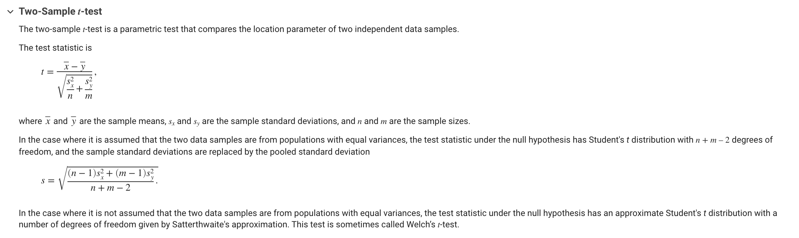

```{r setup, include=FALSE}
knitr::opts_chunk$set(echo = TRUE)
knitr::opts_chunk$set(warning = FALSE, message = FALSE) 
```


# Complete and submit this Rmd by emailing it to either yzh131@u.rochester.edu or omohan@ur.rochester.edu by 12 am on Aug 22, 2022. 


```{r, include = FALSE}
#Installing and loading libraries 
library(tidyverse)
library(dplyr)
library(ggplot2)
```

## R Markdown

This is an R Markdown document. Markdown is a simple formatting syntax for authoring HTML, PDF, and MS Word documents. For more details on using R Markdown see <http://rmarkdown.rstudio.com>.

When you click the **Knit** button a document will be generated that includes both content as well as the output of any embedded R code chunks within the document. 

### Intro to R - Resources 


## Simulating data to work with 

```{r}
#nothing is ever truly random when "randomly" generated on a computer - always psuedo random
#set.seed(124) #can be used to get the same "random" sample consistently 
dog_sample = rnorm(100,20,5)
cat_sample = rnorm(100,15,2)

#random R tip #1: to view any variable, highligh it and Cmd+enter/Ctrl+enter 

#summarizing our data  
dog_mean <- mean(dog_sample)
dog_sd <- sd(dog_sample)

cat_mean <- mean(cat_sample)
cat_sd <- sd(cat_sample)

#visulizing data 
hist_dog <- hist(dog_sample,
main="Distribution of Dog Sizes",
xlab="Size",
col="blue",
alpha = 0.6, 
freq=FALSE,
breaks = 20
)
hist_cat <- hist(cat_sample,
main="Distribution of Cat Sizes",
xlab="Size",
col="orange",
alpha = 0.4, 
freq=FALSE,
breaks = 20
)

#in the same plot 
plot(hist_dog, xlim = c(5, 40), ylim = c(0,20), col = "blue", main = "Distribution of Dog and Cat Sizes", xlab = "Size") + plot(hist_cat, add = TRUE, col = "orange")
legend("topright", c("Dogs", "Cats"), col=c("blue", "Orange"), lwd=5)

```
###############
Q1. Report the mean and sd of the two sample: 

##############


## Null Hypothesis Signifiance Testing (NHST) 

### Readings:
[Null Hypothesis Significance Testing: a short tutorial](https://www.ncbi.nlm.nih.gov/pmc/articles/PMC5635437/) 

#### Storyline for data simulated above: What do we want to test?

Null Hypothesis: 
Alternate Hypothesis: 

###############
Q2. How do you think changing the Null Hypothesis affects the tests conducted, reported results and inferences? 

##############

#### T-test 
Quick Summary: 

Types: 
```{r}
#one line code for each type of test so that after assumptions, they can choose which one to use and use that? 
```
We are using: INDEPENDENT TWO SAMPLE T-TEST - make this a Q? 

##### Assumptions of a t-test
1. Independence 
Well, you can either be a cat or a dog...
Unless you're Muffin the dog-cat or Pico the cat-dog but let's assume that all our cats are only cats and all our dogs are only dogs. 

2. Normality 
For N >= 100, Shapiro-Wilk test for normality 
Insert resource for other kinds of tests?
```{r}

```
Report Normality 

3. Homogeneity - eqaulity of variances 
Levene's Test 
```{r}

```
Report Homogeniety 


###############
Q3. Based on the results of testing the assumptions, what t-test should we do? 
Do it here and report the results - APA style! - Should we given an example of how to report? 

```{r}
#t-test
```
###############


#### The p-value monster 

###############
Q4. What is p-hacking?


###############

#### Confidence Intervals 


#### Some food for thought 

List some extra interesting resources 

###############
Below list three questiosn/comments you have for discussion in the first class based on what you have done above and the readings. Atleast two of the questions should be conceptual. If you have any syntax/code based doubts, do NOT include them here - ask on Slack. The questions you list here will be voted on along with questions from others and we will be disucssing the most popular questions.  
